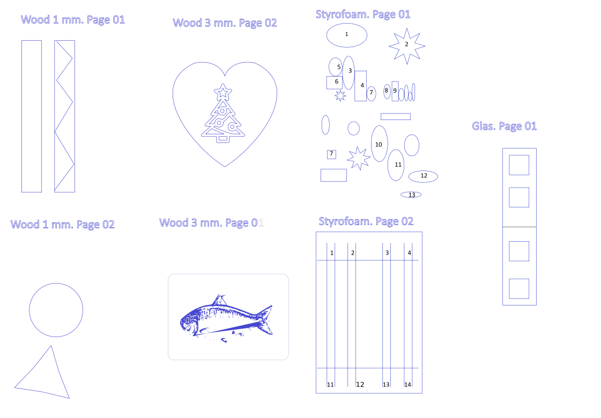

(Update: generation of a test-file added!)
# svg2gcode  (CNC Engrave & Cut in one SVG file)
Scripts for converting / batchprocessing of multilayerd inkscape SVG files into GCODE for variety of CNC progamms like laserGRBL

- Input(1): Multilayered Inkscape SVG, where each Layer should be engraved/cut with different parameters
- Input(2): Parameter setting file
- Output: GCode to process directly in laserGRBL
- Optional: The script can auto-generate supports (leaving tiny edge part so the object can not fall out upon cut)

If have a larger project, you can keep all parts in one file and only separate them through layers in pages. In this case, the script can generate a GCode file for each page.

### Why?
For my CNC project, I work with inkscape  and often want to have all parts and peeces to be in a single SVG file, where I can adjust and adapt the drawing without loosing the overview. However each part and peece can require own material and cutting/engraving parameters. For example I would like first to engrave parts and cut them after, but leaving small supports such that the parts do not fall off. This script package should do exactly this!

### SVG structure

Input:
  (1)A multilayered SVG file. Each root layers name correspond to a material (For example Wood/Sturofoam/Glas etc.) as defined by user. Each material-layer can contain multiple page-layers. Each page layer can contains multiple procedure layers (example: Cut/Engrave/Write etc.) as defined by user.
 
 input.svg
  - |-Material - Layer (Wood/Sturofoam/etc.)
  - |    |-PageNr - Layer
  - |        |-Procedure -Layer (Cut/Engrave/etc.)
  - |            object1
  - |            objectn
  - |-Material2 ... 
            
  (2) A set of rules of how to parametrize a particular material-procedure combination. Parameters include feed, laser strength, passes, whether support should be added to cutting peeces, etc.

Output:
  For each page-layer a GCODE fiel is generated where all procedure layers are merged into one. Thus a page can be carried out at once.

### Pre-Requisites
- <a href="https://inkscape.org/">inkscape</a> for the program to easily design of parts in SVG
- <a href="https://github.com/arkypita/LaserGRBL">LaserGRB</a>Or othe CGode programm
- Install Python (e.g simplest through <a href="https://www.anaconda.com/products/individual">Anaconda</a>) 
### Installation
 - (2) Download/clone the project 
 - (3) Install python dependencies:
      pip install -r requirements.txt
 - (4) Done
 

After installation just run the toy example with supplied toy.svg and material.ini:

python main.py --file toy.svg --configfile=material.ini --tempfolder tmp --outputfolder toyresult -v True

The output will be stored into the folder "toyresult" page by page.

Open and use any generated GCode file from "toyresult" in your CNC programm (like laserGRBL)

### Setting Details
The Layers of the SVG should be in Hierachy: Material->Page->Porcess. The ini file should have a section for each Material-Process pair with parameters as follows:

- [Wood1mm.Cut] #Format Material.Procedure
- speed=300 # The F parameter of the GCode - determines the cutting speed (or feed) in mm/min
- strength=950 # The S aprameter of the GCode - determines the laser strength (0-1000) 
- support_gap=1 # If present, the support gaps will be added automatically to each cut. The value determins the length of support in mm.
- support_strength=0 # Determins the laser strength (S) when cutting the sipport part (0(laser off) - 1000 (laser 100%)).
- repeat=2 # Times the process should be repeat. whilst engraving typically does not need this, cutting my often need more then 1 pass.

### Known issues/limitations:
The software is highly experimental, I had to learn many things by doing and I had to do it fast. The code is a mess. The names of the parametrers are not standartized and should be renamed in the futute (e.g "speed" and "strength" should become "F" and "S", respectively)

The software may have issues. Please check the generated output (even better would be to simulate ) before cutting
Example simulator: https://ncviewer.com/

## Generation of a Test-File
Often you want to test, how your laser would cut at different settings. Typically ypu want to cat as fas as possible with slightly reduced laser (to keep it living longer) and you want to achive particular cut-depth. To do this, the best way is to generate a test file that will cut at different settings on a test sheet that you can use later to read the parameters you need.
Something like:

Where each block corresponds toa  particular S (laser stregth) and each circle is cut at different F (head moving speed)
This can be done now. Just define the S sections and corresponding F sequence in "ovaltest.ini" amnd execute:
`
python testmaker.py -c ovaltest.ini -o ovaltest
`
The resulting files will be written to "ovaltest/input_oval/Material/Page01.input_oval.Material.gcode"
Automatically generated SVG ("input_oval.svg") and cut-setting (input_oval_settings.ini) can be viewed as well in the folder "ovaltest" 

### CREDITS:
- <a href="https://inkscape.org/">inkscape</a> for the program to easily design of parts in SVG
- <a href="https://pypi.org/project/pygcode/">pygcode</a> for the packege for conversion SVG to GCODE
- <a href="https://github.com/arkypita/LaserGRBL">LaserGRB</a>for a great UI to display GCODE and communicate with hardware
- <a href="https://www.ebay.de/sch/i.html?_from=R40&_trksid=p2380057.m570.l1313&_nkw=cnc+laser&_sacat=0">All cheap CNC Laser hardware</a> for making real objects out of computer drawings

